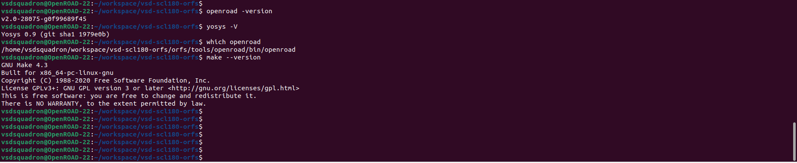
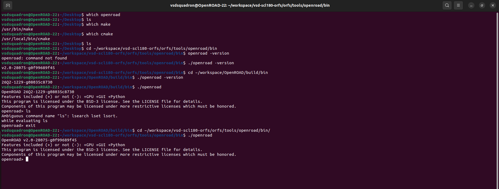
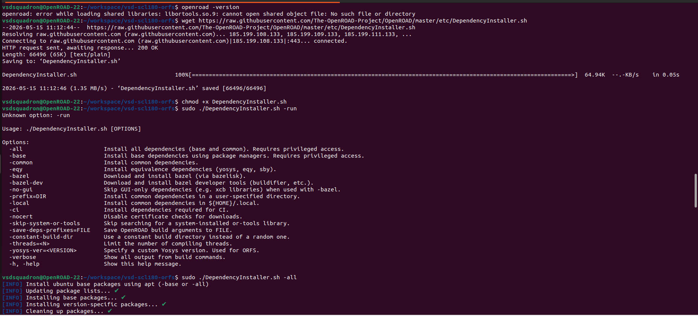
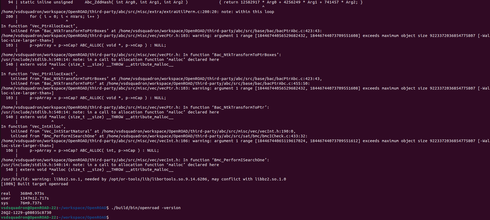
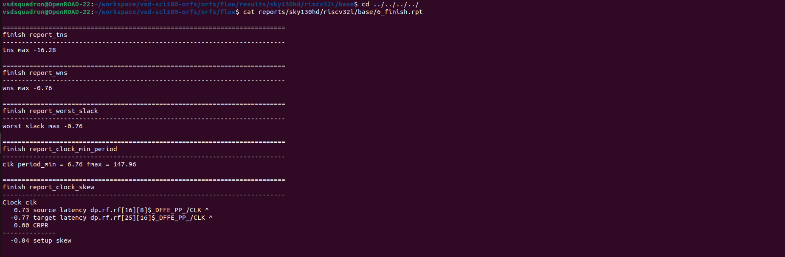
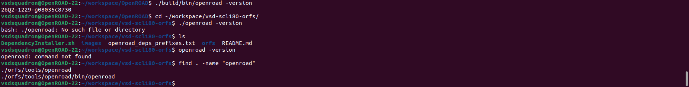
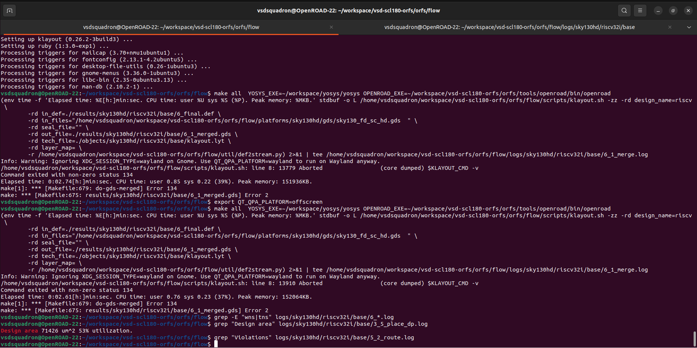

#  VSD-Squadron RTL to GDSII SOC Implementation

## WEEK-1 (Digital VLSI SoC Design and Planning – Foundation Phase)

<b>PHASE 1 — OpenLANE Flow Familiarity</b>

 

The initial steps to invoke openlane flow.

 

Prepping the design involves setting all the environment variables like PDK, SDC file and standard cell library used. Below statistics shows the synthesis report about the standard cells used to synthesize picorv32a netlist. 

 

Flop ratio = no.of flipflops/Total no of cells = 1613/15762 = 10.2%. 

 

Synthesis report shows the area occupied by the logic
 

 
Timing report generated after the synthesis step. Both TNS and WNS are zero. Worst slack is 0.52ns. Library used ``nom`` typical library.

<b>PHASE 2 — Floorplan Fundamentals</b>

 

 

Aspect ration and the utilization factor in the config.tcl file.

 

Die area from the def file generated after the floorplan step

 

Changing the  utilization factor to 30% and then running the floor plan again. 

 

Die area is changed as it can be observed from the new def file.

 

 

 

RAM is a macro different from a standard cell. These Macro's are placed along with preplaced cells before floorplan and placement. During the placement stage standard cells are placed. These Macro are blackboxed, it means these macro's are already implemented so only the input and output pins.

<b>PHASE 3 — Timing Literacy with Ideal Clocks</b>

 

The ``pre_sta.conf`` file used to run timing analysis using OpenSTA

 

 

 

 

 

 

After replacing a cell with large fanout of 10

 

The new modified slack value from the report checks command

 

After changing synthesis strategy from "AREA O" to "DELAY 3" and then running the timing analysis changes the slack value to -2.79ns.

 

 

<b>PHASE 4 — CTS and Timing with Real Clocks</b>

 

 

 

 

 

 

 

 

<b>PHASE 5 — PDN Awareness</b>

 

 

 

 

In the RTL-to-GDSII flow, the PDN is build immediately after floorplanning (and sometimes macro placement), long before you route a single data signal.
Power and ground (VDD and VSS) need to travel across the entire chip with the least possible resistance. Therefore, they claim the top, thickest metal layers.

## WEEK-2 (Toolchain Mastery and ORFS Execution [Cloud to Local])

<b>PHASE 1 — ORFS Execution in GitHub Codespaces</b>

 
 
Cloned this repo `` https://github.com/vsdip/vsd-scl180-orfs ``and then launched github codespaces.

After a successful dev container build, checking whether all the required tools are present.

 

<b>PHASE 2 — Toolchain Understanding (Devcontainer Deep Dive)</b>

 

# Tools used in the flow

| S.No | Tool Name | Installed From | Purpose in the flow | Stage used | 
|------|-----------|----------------|---------------------|------------|
| 1 | OpenROAD | Compiled from source | Bind all the tools for PnR flow | All the stages after Synthesis |
| 2 | Yosys |Compiled from source  | Synthesizing the netlist | Synthesis |
| 3 | TritonCTS | Integrated within OpenROAD | Generation of Clock Tree | During CTS | 
| 4 | FastRoute | Integrated within OpenROAD | Global Routing | Routing | 
| 5 | OpenSTA | Integrated within OpenROAD | Static Timing Analysis | Timing check at all stages | 
| 6 | KLayout | Compiled from source |Layout Viewer | Final sign-off & GDS generation | 
| 7 | Python | Package Manager | Calculating Run times | Reporting & log creation | 
| 8 | Make | Package Manager | Running flow scripts | All the stages | 
| 9 | Git | Package Manager | Version Cotrol | Environment setup | 
 
----

### **What ORFS automates**

ORFS automates the passing of data between completely separate point tools (Yosys -> OpenROAD -> KLayout). It automates the complete RTL2GDSII flow using Makefiles. Using one command "make all", it generates all the reports and final GDS with the required results.

----

### **How makefiles orchestrate the flow**

It creates switches for every step of the flow. Like make synth, make floorplan, make place, make gui_place. For every operation underneath the make switch
it runs a script to send the result to the appropriate location and take the appropriate inputs from the correct locations.

The true power of a Makefile is Dependency Tracking. If you edit your Verilog file, the Makefile knows it has to rerun Yosys. It orchestrates the flow by tracking the timestamps of input and output files to ensure steps are only run when necessary.

-----

### **Where synthesis ends and physical design begins**

synthesis means converting RTL into gate level netlist. Yosys creates the netlist. SDC constranints + netlist(from synthesis) is merged into one file .odb file. 
this odb file is the input for place and route step.

Physical design begins when OpenROAD spins up and imports three separate things: The Yosys Verilog netlist, The technology files (LEF/LIB) and The SDC constraints (Separate file) Once OpenROAD reads all three of those pieces into its memory to initialize the floorplan,then it saves that combined state as the very first 1_synth.odb database.

-----

### **Where timing is checked**

At every stage actually. After synthesis, after placement we call it prelayout sta with ideal clocks. after cts pre-layout sta with actual clocks.after routing 
post layout sta

------

### **Where GDS is produced**

OpenROAD finishes by producing a .def or .odb file, which is just an abstract text description of where the wires are. GDS is produced during the make finish stage. A completely different tool (KLayout or Magic) takes the abstract OpenROAD routing data and physically merges it with the exact, proprietary polygon shapes provided by the foundry (SkyWater) to draw the final photographic mask (.gds).

------

<b>PHASE 3 — Local Installation (Self-Owned Environment)</b>

 

The image below shows the tools that are locally installed to run the flow

The OpenROAD toolchain supports two installation approaches: a pre-built binary installation (used in the Cloud Codespaces environment) and a manual compilation from source (used for the local Ubuntu VM).

The dependencies required to compile openroad from the source.

Successful compilation of the OpenROAD toolchain from source. The terminal indicates a 100% build completion and verifies the executable by querying the installed version (26Q2-1229-g08035c8730).

<b>PHASE 4 — Re-Run RTL-to-GDS Locally</b>

 

| Metric        | Cloud | Local |
|----------------|------|-------|
| Runtime        |  2189s     |   6855s     |
| WNS            |  -0.57     |  -0.76      |
| TNS            |  -10.31    |  -16.28     |
| GDS Generated  |    Yes     |    Yes      |

<b>PHASE 5 — Debugging and Unix Literacy</b>

 

### Essential Unix Commands for Physical Design

During the RTL-to-GDSII flow, navigating thousands of lines of logs and deeply nested directories requires basic Unix literacy. Here are three incredibly powerful commands used to extract physical design metrics efficiently:

#### 1. The `cat` Command
**Description:** Short for "concatenate," `cat` is used to instantly read the contents of a file and print it directly to the terminal. In physical design, it is perfect for quickly reading short summary files, like the final timing reports, without having to open a heavy text editor.

#### 2. The `find` Command
**Description:** The `find` command is a search engine for your terminal. When an automated flow generates hundreds of intermediate database files, `find` allows you to instantly locate a specific file (like a `.def` or `.gds`) by searching through the current directory and all sub-directories.

#### 3. The `grep` Command
**Description:** Short for "Global Regular Expression Print," `grep` is arguably the most used Unix command in VLSI. It allows you to search for a specific word or phrase inside a massive file and prints only the lines containing that phrase. Here, it is used to instantly extract the exact "Design area" metric from a massive synthesis log file without scrolling manually.

