# Caravel Integrated Test Results

| tests-caravel | status |
| :--- | :--- |
| user_pass_thru | PASS |
| uart | PASS |
| sysctrl | FAIL |
| sram_exec | PASS |
| spi_master | PASS |
| pullupdown | PASS |
| pll | FAIL |
| pass_thru_fix | PASS |
| mem | PASS |
| hkspi_power | PASS |
| gpio_mgmt | PASS |
| hkspi |PASS |

### Caravel Integrated Test Results (Screenshots)

**1. GPIO Management**
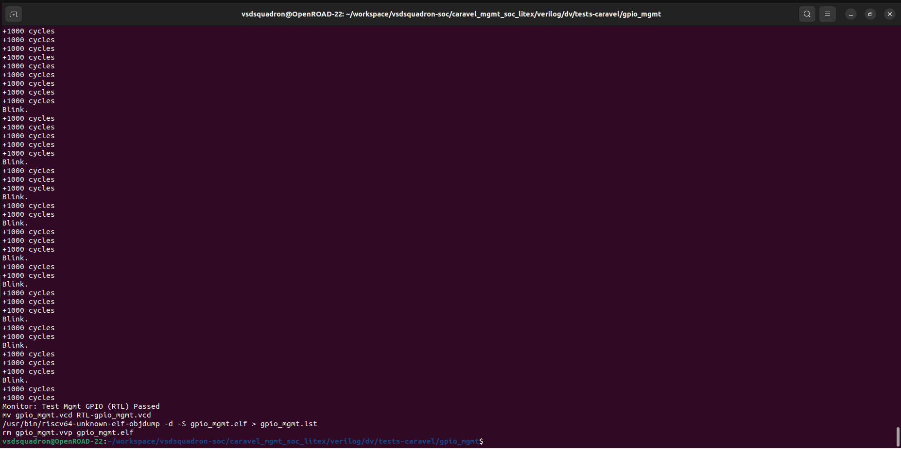

**2. HKSPI**
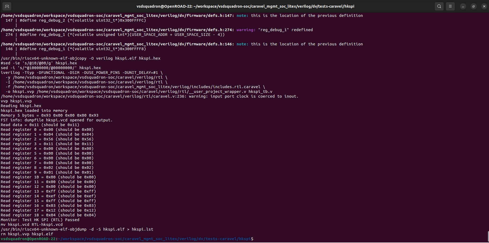

**3. HKSPI Power**
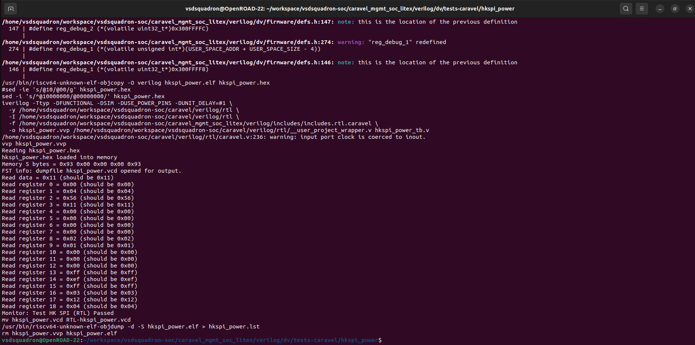

**4. Memory (Mem)**
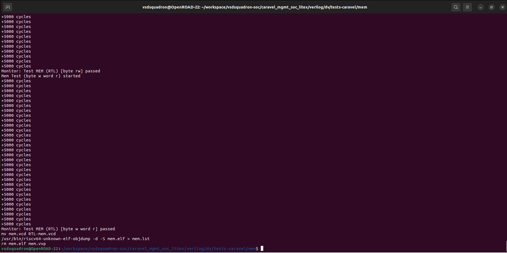

**5. Pass Thru Fix**
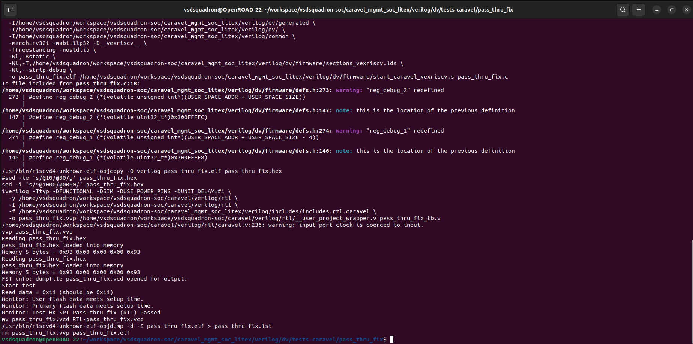

**6. PLL**
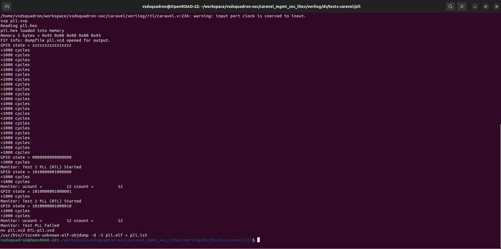

**7. Pull Up / Down**
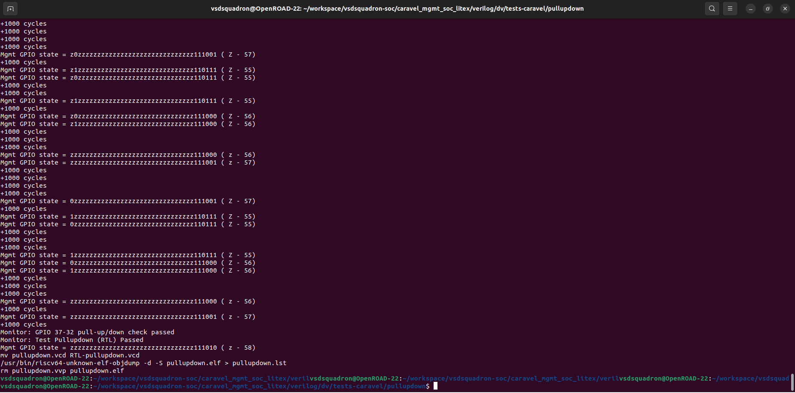

**8. SPI Master**
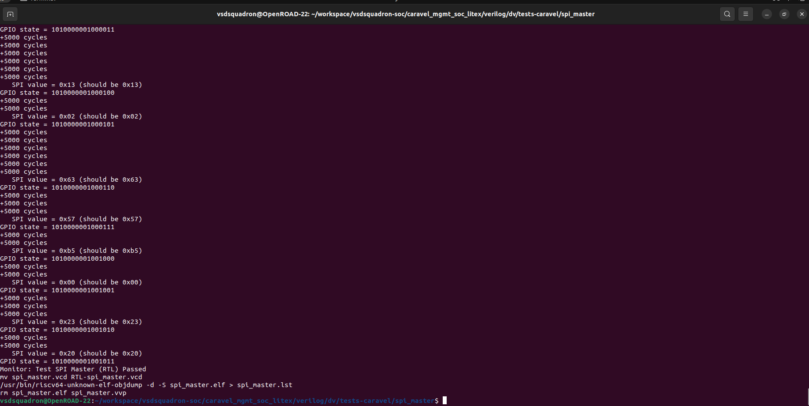

**9. SRAM Exec**
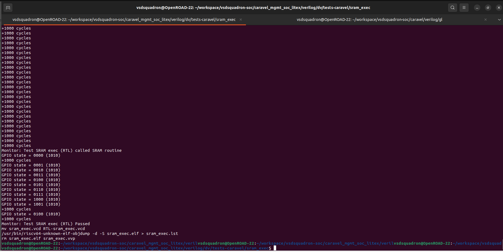

**10. System Control (sysctrl)**
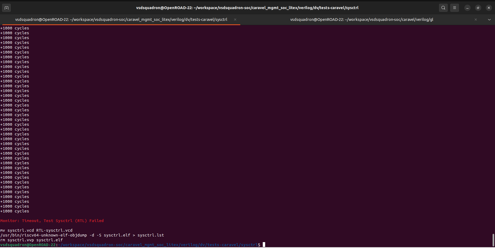

**11. UART**
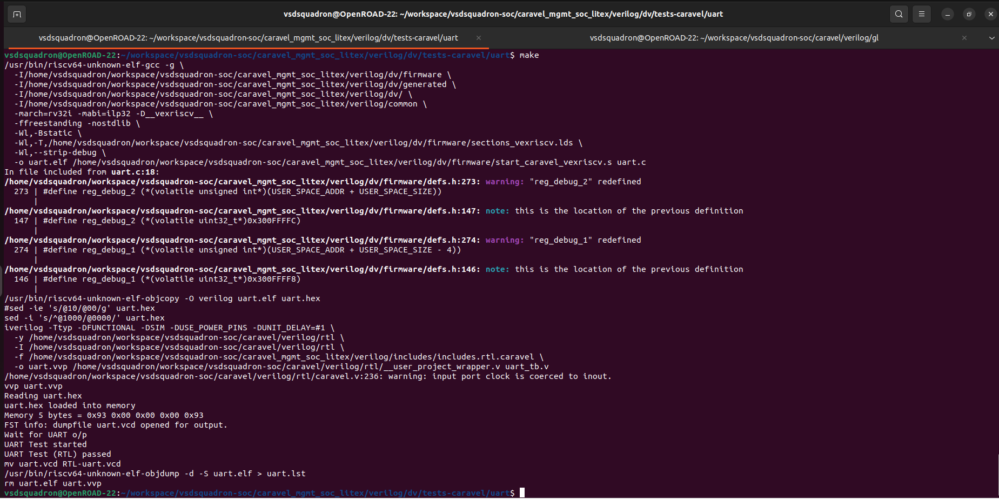

**12. User Pass Thru**
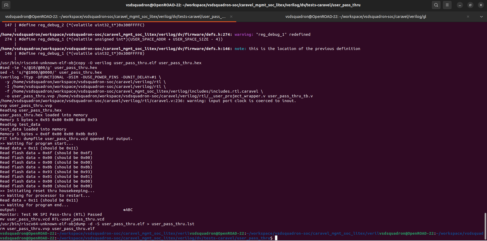
