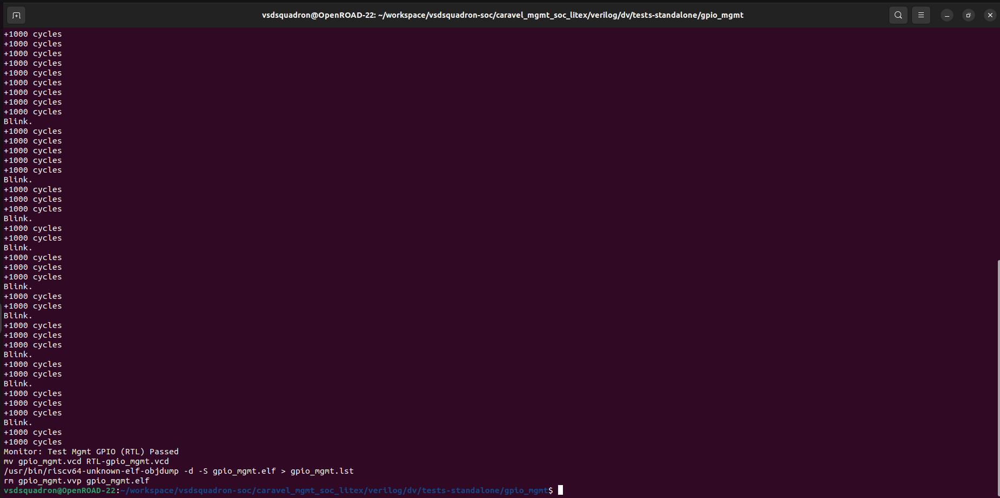
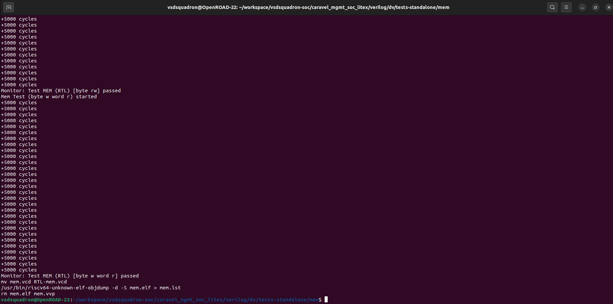
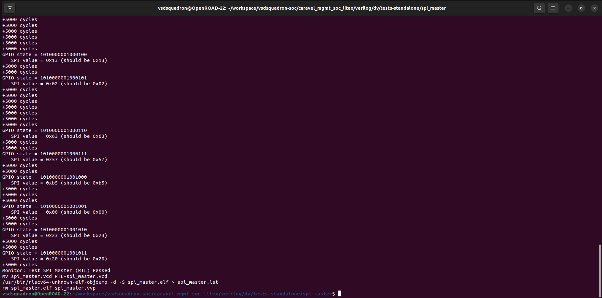
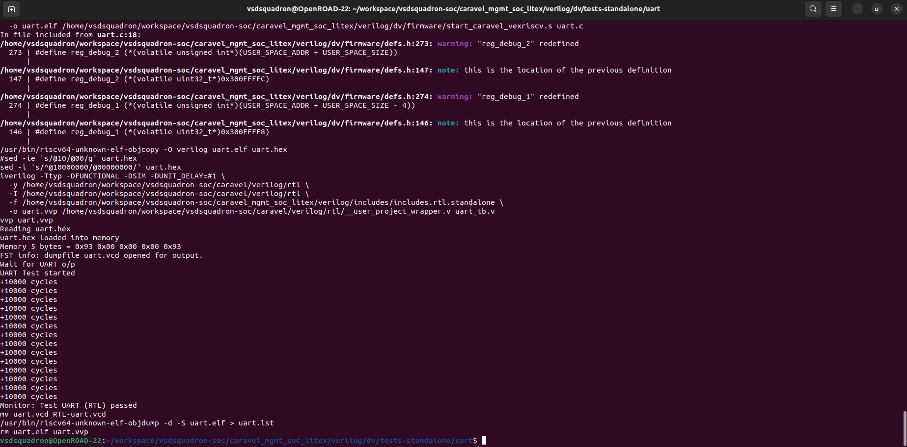
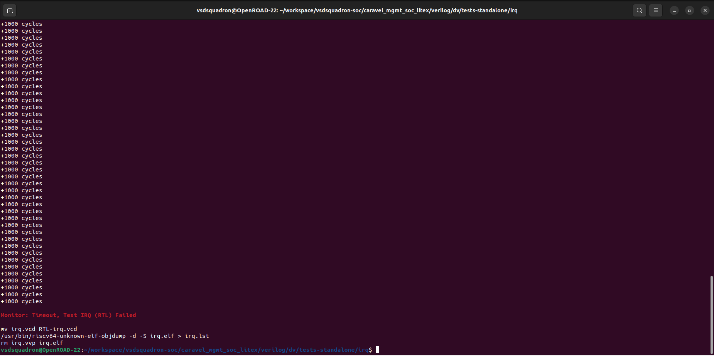
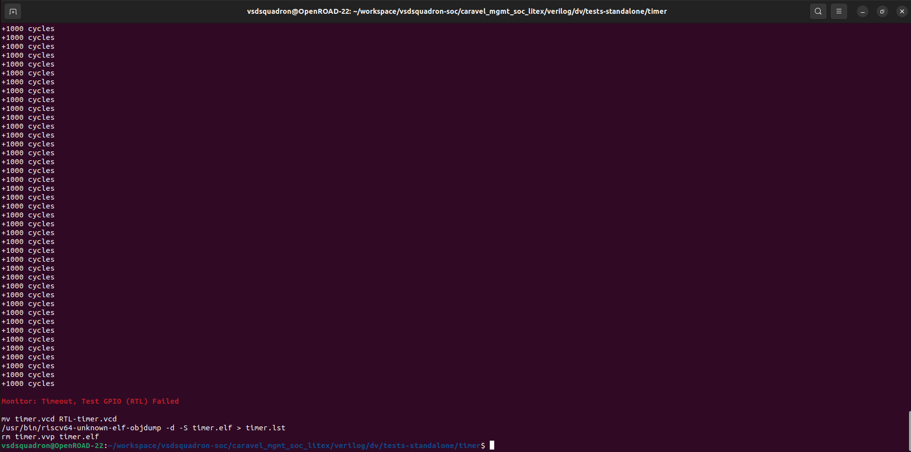

# Standalone Test Results

| tests-standalone | status (sky130) |
| :--- | :--- |
| GPIO Mgmt | PASS |
| mem | PASS |
| uart | PASS |
| timer | FAIL |
| irq | FAIL |
| debug | FAIL |
| spi_master | PASS |

### Standalone Test Results (Screenshots)

**1. GPIO Management**

**2. Memory (Mem)**

**3. SPI Master**

**4. UART**

**5. IRQ (Interrupt Request)**

**6. Timer**

