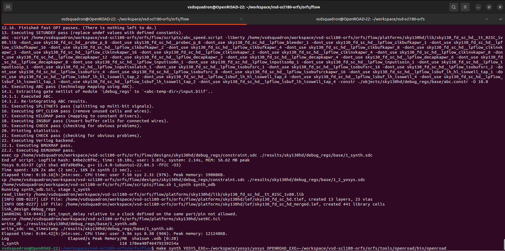
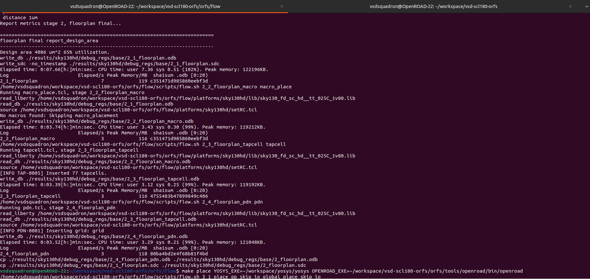
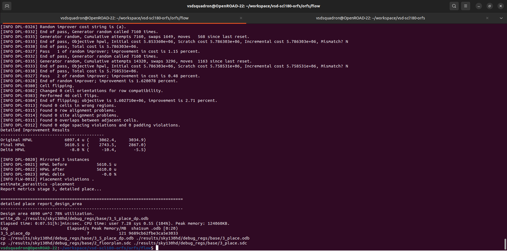
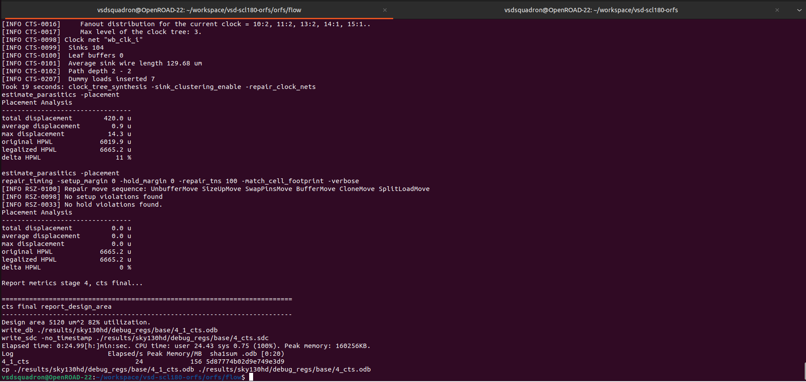
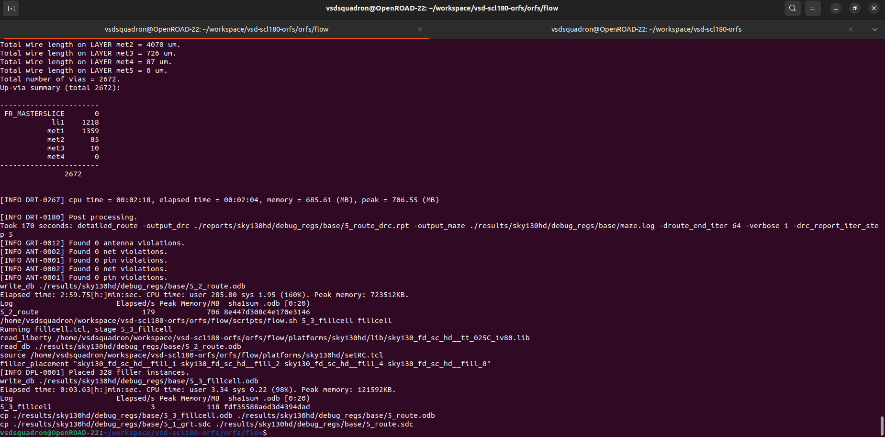
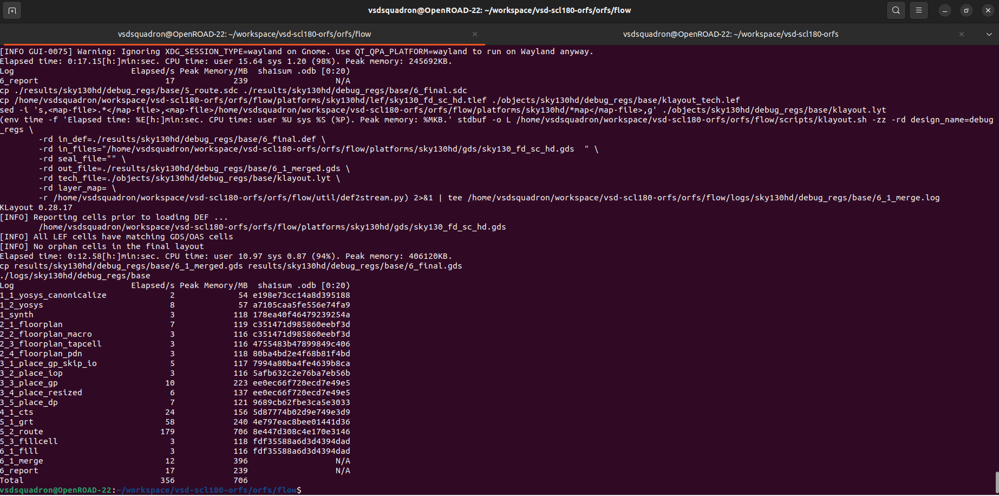
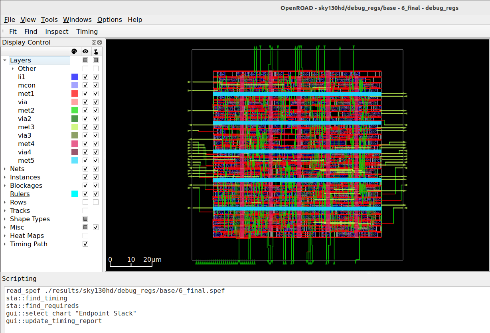

# RTL2GDSII Implementation

---

## 1. Synthesis

Converts RTL (Verilog) into a gate-level netlist using standard cell libraries.



| Metric | Value |
|--------|-------|
| Total cells | 294 |
| Flip-flops (`dfrtp_1`) | 97 — `debug_reg_1[31:0]` + `debug_reg_2[31:0]` + `wbs_dat_o[31:0]` + `wbs_ack_o` |
| Key logic cells | 64× `mux2_2` (byte-select) · 32× `a211oi_1` (decode) · 8× `nor4_4` (address) |
| Chip area | **4182.76 µm²** |
| Sequential area | 2427.33 µm² (58%) |

---

## 2. Floorplan

Defines the chip's core area, places I/O pins, and sets power grid structure.



| Metric | Value |
|--------|-------|
| Clock model | Ideal (CTS not run yet) |
| Worst setup slack | 6.32 ns |
| fmax estimate | 271.38 MHz |
| Critical path | `wbs_stb_i` → `debug_reg_1[0]` = 2.62 ns |
| Total power | 0.473 mW (clock = 0 — tree not built) |
| Violations | 0 setup · 0 hold |

> Reset inverter `_326_` (`inv_1`) drives all 97 FFs at this stage (fanout = 97, slew = 2.84 ns). CTS will fix this.

---

## 3. Placement

Places all standard cells within the floorplan boundary.



Standard cells placed and legalised inside the core. Resizer pass applied after placement to fix transition and capacitance violations by upsizing cells and inserting buffers where needed.

---

## 4. Clock Tree Synthesis (CTS)

Builds a balanced clock distribution network to minimise clock skew.



**Clock tree built:** 1 root `clkbuf_8` → 8 leaf `clkbuf_8` buffers → 97 flip-flops

**Reset fanout fixed by CTS:**

| | Before CTS | After CTS |
|-|-----------|-----------|
| Inverter | `inv_1` (weak) | `inv_4` (4× drive) |
| Fanout | 97 FFs direct | Split via `buf_4` buffer |
| Slew | 2.84 ns (bad) | 0.42 ns (clean) |

| Metric | Value |
|--------|-------|
| Clock model | Propagated (real delays) |
| Setup skew | **0.21 ns** across all 97 FFs |
| Worst setup slack | 6.69 ns |
| fmax after CTS | **302.38 MHz** |
| Clock tree power | 0.287 mW (36% of total) |
| Violations | 0 setup · 0 hold |

---

## 5. Routing

Connects all placed cells using metal interconnects.



| Layer | Wire length | Vias |
|-------|------------|------|
| met1 | 4070 µm | 1359 |
| met2 | 726 µm | 85 |
| met3 | 87 µm | 10 |
| met4/5 | 0 µm | 0 |
| **Total** | — | **2672** |

| Check | Result |
|-------|--------|
| DRC violations (`5_route_drc.rpt`) | **0** — empty file = clean |
| Antenna violations | 0 |
| Net / Pin violations | 0 |
| Filler cells inserted | 328 |

> `5_route_drc.rpt` is empty because there are zero violations — this is the correct outcome, not a missing step.

---

## 6. Final Sign-off

Post-route DRC, LVS, and timing sign-off.



| Metric | Value |
|--------|-------|
| fmax | **303.61 MHz** (period_min = 3.29 ns) |
| Worst setup slack | **+6.71 ns** |
| Critical path | `wbs_adr_i[2]` → `debug_reg_2[21]` = 3.33 ns |
| Hold slack | +0.31 ns |
| Clock skew | 0.21 ns |
| Total power | **0.792 mW** (FFs 54% · Clock tree 36% · Logic 10%) |
| Setup / Hold violations | **0 / 0** |
| Slew / Cap / Fanout violations | **0 / 0 / 0** |

**Final SDC confirms:** `create_clock -period 10.0000` — 100 MHz used throughout all stages.

---

## 7. GDS Final Output

The final GDSII file ready for tape-out.



| Output file | Purpose |
|-------------|---------|
| `results/6_final.gds` | Physical layout — sent for fabrication |
| `results/6_final.v` | Gate-level netlist — used for GLS verification |
| `results/6_final.sdc` | Final timing constraints |
| `results/6_final.spef` | Extracted parasitics (RC of all nets) |


## Flow Commands

All commands run from the ORFS flow directory:

```bash
cd ~/workspace/vsd-scl180-orfs/orfs/flow
```

| Command | Stage | What it runs |
|---------|-------|-------------|
| `make synth` | 1 | Yosys — reads `debug_regs.v`, maps to sky130 cells, writes gate-level netlist |
| `make floorplan` | 2 | OpenROAD — defines die/core area, places I/O pins, builds power delivery network (PDN) |
| `make place` | 3 | OpenROAD — global placement + detailed legalisation + resizer pass |
| `make cts` | 4 | OpenROAD — inserts clock buffers, builds balanced tree, eliminates skew |
| `make route` | 5 | OpenROAD (TritonRoute) — global + detailed routing, antenna fixing, filler insertion |
| `make final` | 6 | OpenROAD — post-route STA, power analysis, DRC sign-off, writes `6_final.gds` and `6_final.v` |
| `make gui_final` | — | Opens OpenROAD GUI with the completed `6_final` design loaded for visual inspection |

> Each stage depends on the previous — running `make final` without `make cts` will automatically run all missing stages in order.


